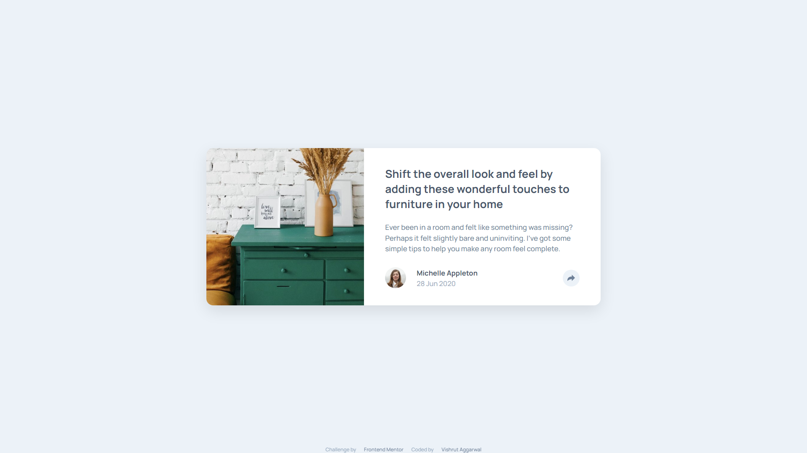
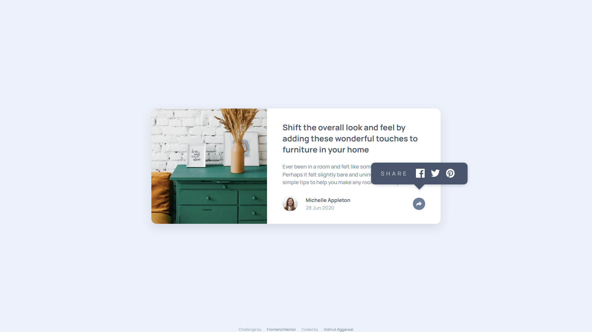
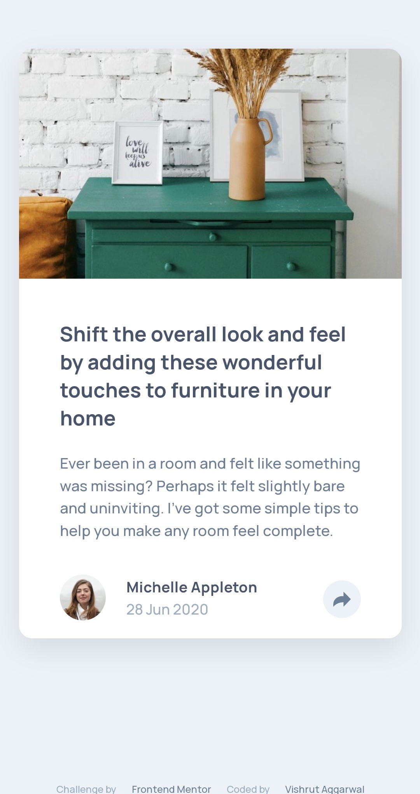
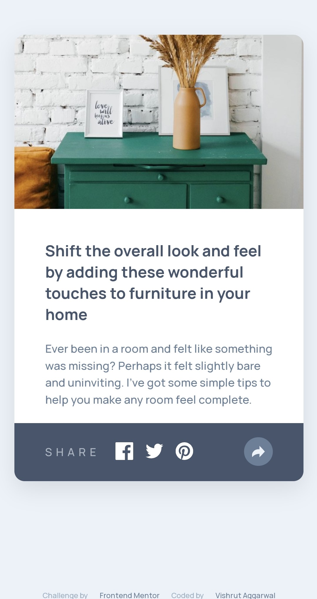

# Frontend Mentor - Article preview component solution

This is a solution to the [Article preview component challenge on Frontend Mentor](https://www.frontendmentor.io/challenges/article-preview-component-dYBN_pYFT). Frontend Mentor challenges help you improve your coding skills by building realistic projects. 

## Table of contents

- [Overview](#overview)
  - [The challenge](#the-challenge)
  - [Screenshot](#screenshot)
  - [Links](#links)
- [My process](#my-process)
  - [Built with](#built-with)
  - [What I learned](#what-i-learned)
  - [Continued development](#continued-development)
  - [Useful resources](#useful-resources)
- [Author](#author)
- [Acknowledgments](#acknowledgments)

## Overview

### The challenge

Users should be able to:

- View the optimal layout for the component depending on their device's screen size
- See the social media share links when they click the share icon

### Screenshot

Desktop View:

Mobile View:

### Links

- Solution URL: [Add solution URL here](https://github.com/VishrutAggarwal/article-preview-component-master)
- Live Site URL: [Add live site URL here](https://vishrutaggarwal.github.io/article-preview-component-master/)

## My process

First created the HTML structure.
Slowly added the CSS elements.
First the positioning elements were used.
Later the font elements were corrected.
Afterwards, The colors were correctly assigned.
Hover transitions were added.
Some JavaScript functionality was added.
Lastly, some finishing touches were given.

### Built with

- Semantic HTML5 markup
- CSS custom properties
- Flexbox
- Webkit
- JavaScript

### What I learned

I learned how to structure HTML and CSS in accordance for JavaScript functionality.
On-Click events and DOM using JavaScript.

### Continued development

I would improve on my JavaScript DOM and CSS manipulation.
Further knowledge on jQuery and Bootstrap to enhance my design and save time.
Need to further optimize my code.

### Useful resources

- [W3Schools](https://www.w3schools.com/css/) - This helped me for CSS and JS.
- [MDN Web Docs](https://developer.mozilla.org/en-US/docs/Web/CSS) - This helped me for webkit.

## Author

- Frontend Mentor - [@VishrutAggarwal](https://www.frontendmentor.io/profile/VishrutAggarwal)
- LinkedIn - [Vishrut Aggarwal](https://www.linkedin.com/in/vishrut-aggarwal/)

## Acknowledgments

Thanks to Frontend Mentor to give me this opportunity.